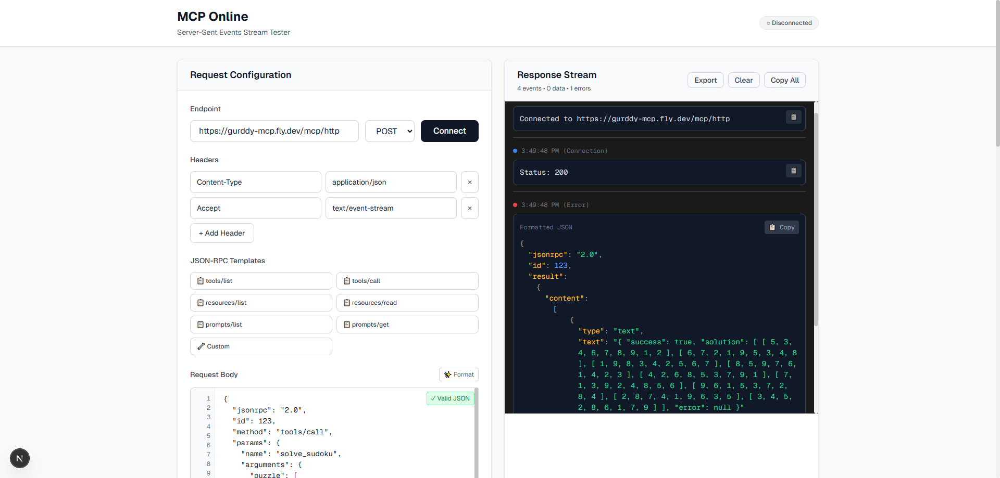

# MCP Online - SSE Stream Tester

A Next.js application for testing Server-Sent Events (SSE) streams, particularly useful for testing MCP (Model Context Protocol) endpoints.

## Features

- **Real-time SSE Stream Testing**: Connect to any SSE endpoint and view events as they arrive
- **Custom Headers**: Add, edit, and remove HTTP headers for your requests
- **Advanced JSON-RPC Editor**: Enhanced request body editor with syntax highlighting, validation, and templates
- **Enhanced JSON Display**: Beautiful syntax highlighting and formatting for JSON-RPC responses
- **Session Management**: Automatically saves and restores your settings across browser sessions
- **Event Categorization**: Visual indicators for different event types (connection, data, error, info)
- **Export Functionality**: Export complete session data including events and settings as JSON
- **Display Customization**: Toggle JSON formatting, timestamps, and auto-scroll behavior
- **Copy & Export**: Copy individual events, formatted JSON, or the entire stream output
- **Connection Control**: Start and stop streams with abort functionality

## Getting Started

First, install dependencies and run the development server:

```bash
npm install
npm run dev
```

Open [http://localhost:3000](http://localhost:3000) with your browser to see the application.




## Usage

1. **Enter URL**: Input your SSE endpoint URL (must start with https://)
2. **Configure Headers**: Add necessary headers like authentication tokens
3. **Set Request Body**: For POST requests, configure your JSON payload
4. **Customize Display**: Toggle JSON formatting, timestamps, and auto-scroll in Display Settings
5. **Connect**: Click "Connect" to start the SSE stream
6. **Monitor**: Watch real-time events with beautiful formatting and syntax highlighting
7. **Export**: Use "Export" to download session data or "Copy All" for clipboard access
8. **Control**: Use "Stop" to abort the connection, "Clear" to reset events

## Session Management

The application automatically saves your settings including:
- Endpoint URL and HTTP method
- Custom headers configuration
- Request body content
- Display preferences (JSON formatting, timestamps, auto-scroll)

Settings persist across browser sessions and are restored when you reload the page.

## JSON-RPC Editor Features

### Built-in Templates
- **tools/list**: List available MCP tools
- **tools/call**: Call a specific MCP tool
- **resources/list**: List available resources
- **resources/read**: Read a specific resource
- **prompts/list**: List available prompts
- **prompts/get**: Get a specific prompt
- **custom**: Custom JSON-RPC template

### Editor Capabilities
- **Line Numbers**: Visual line numbering for easier editing
- **Syntax Validation**: Real-time JSON validation with error highlighting
- **Auto-formatting**: One-click JSON formatting and beautification
- **Minification**: Compress JSON for smaller payloads
- **Character Count**: Live character count display
- **Auto ID Increment**: Automatic JSON-RPC ID management
- **Copy/Paste Support**: Easy clipboard integration

## Default Configuration

The app comes pre-configured with:
- Content-Type: application/json
- Accept: text/event-stream
- Standard JSON-RPC 2.0 tools/list request body
- JSON formatting enabled
- Timestamps and auto-scroll enabled

## Enhanced Features

### JSON-RPC Response Formatting
- Automatic detection and parsing of JSON content
- Syntax highlighting with color-coded types (strings, numbers, booleans, etc.)
- Collapsible object and array structures
- Copy buttons for both raw and formatted content

### Event Categorization
- **Connection Events**: Blue indicators for connection status and HTTP responses
- **Data Events**: Green indicators for actual SSE data
- **Error Events**: Red indicators for errors and failures
- **Info Events**: Yellow indicators for informational messages

### Export Capabilities
- Export complete session data as JSON including:
  - Timestamp and configuration
  - All events with metadata
  - Both raw and formatted content
- Individual event copying with one-click buttons

## Technical Details

- Built with Next.js 16 and React 19
- Uses native Fetch API with ReadableStream for SSE handling
- Implements proper SSE parsing according to the specification
- Includes abort controllers for clean connection management
- LocalStorage-based session persistence
- Styled with Tailwind CSS for responsive design
- Custom JSON syntax highlighting component